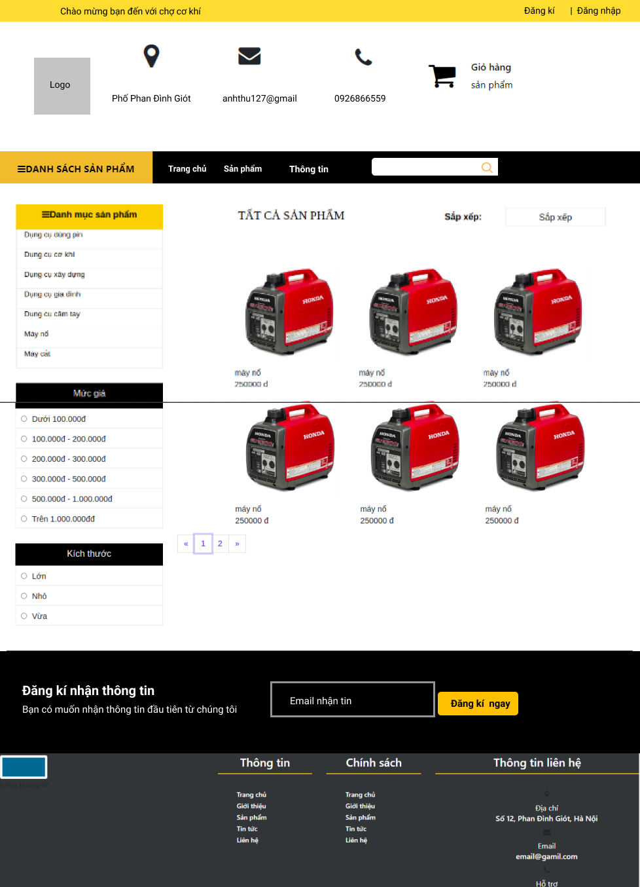
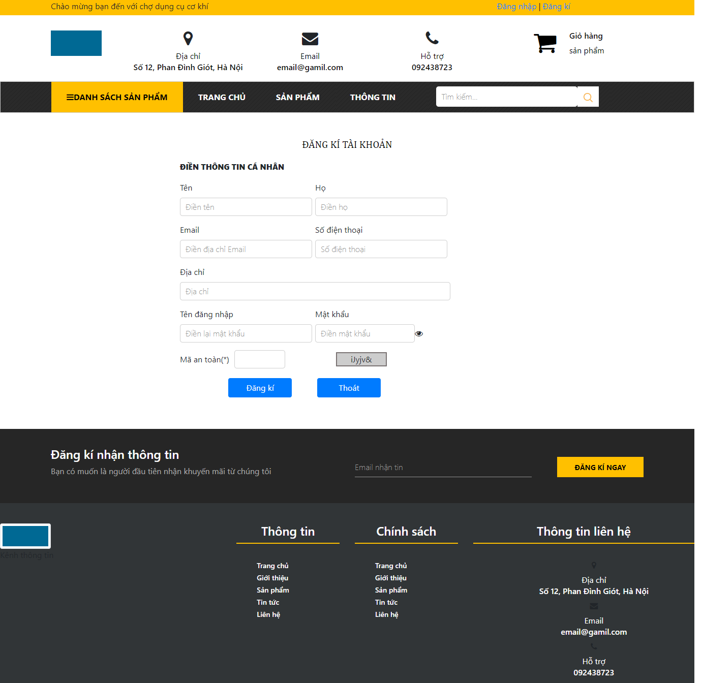
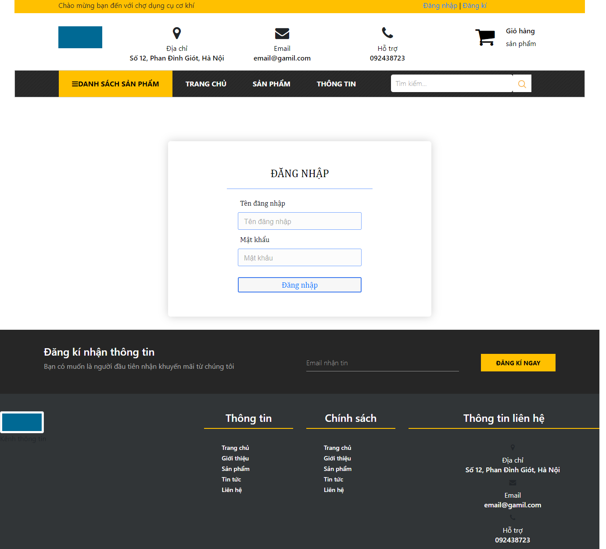
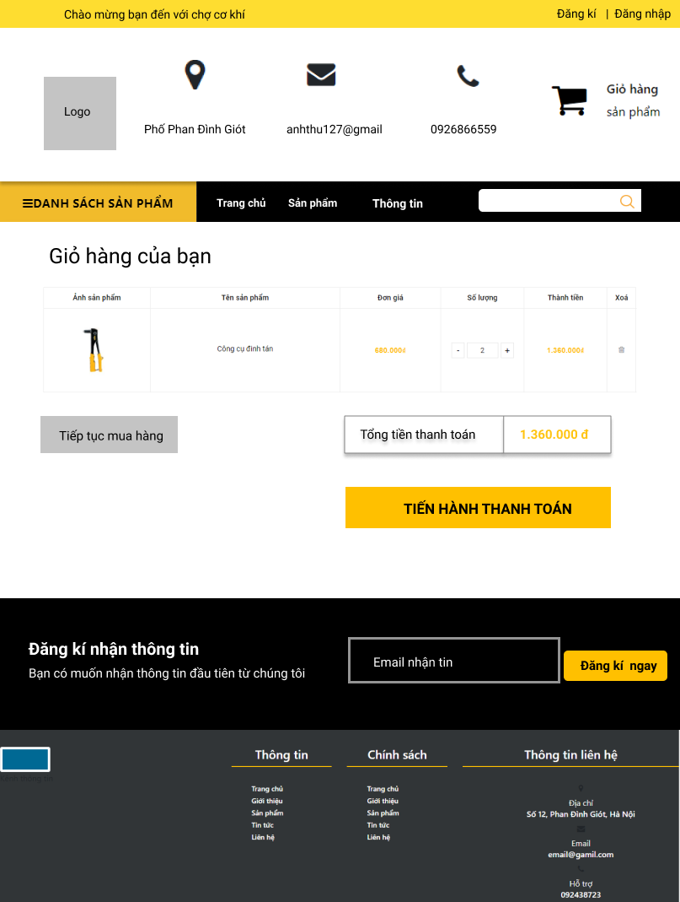
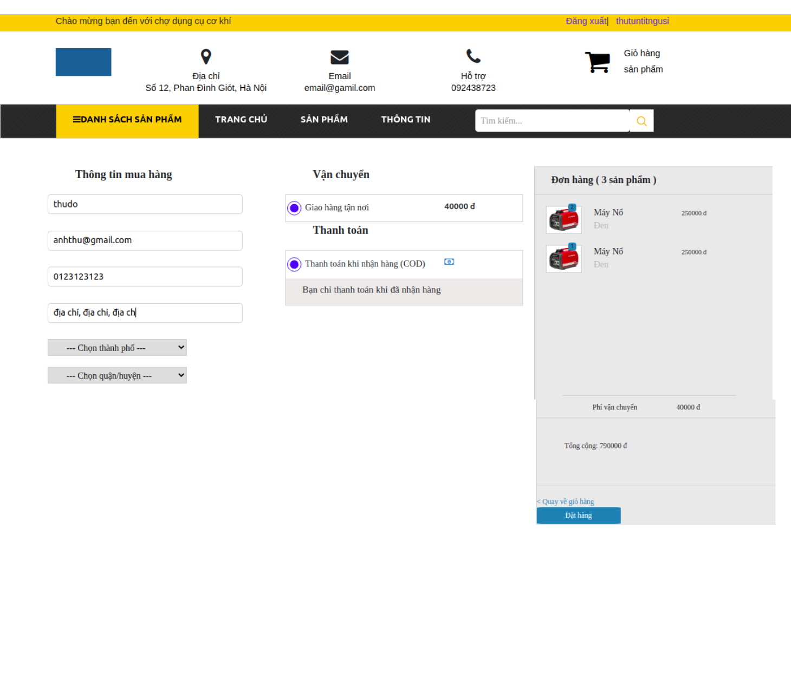
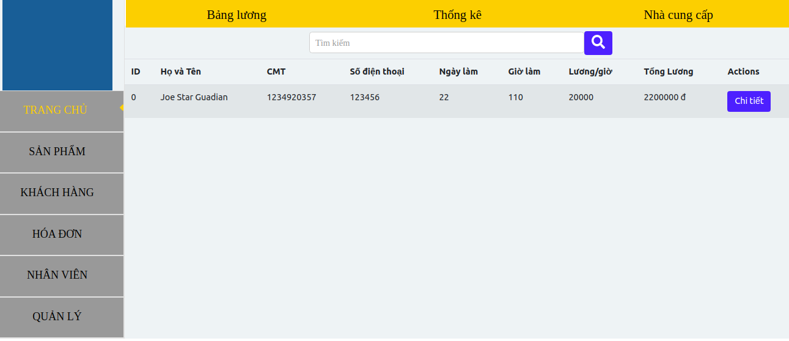
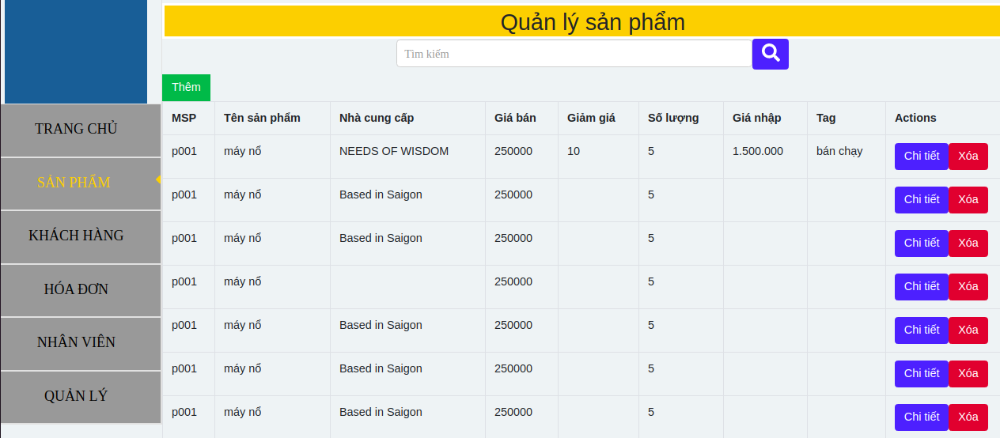

# Trang web bán linh kiện cơ khí 

## Mục tiêu
  Xây dựng trang web hiển thị các sản phẩm mà cửa hàng đang bán,
  cho phép người dùng mua sản phẩm phù hợp nhu cầu.
  
## Công nghệ sử dụng
     
    Back-end: JSON-SERVER

    Database: JSON File

    Front-end: ReactJS  

## Hướng dẫn cài đặt

 
 1. Clone code tại [đây](https://github.com/anhthutun/Project2.git)  
  
 2. Cài đặt node-module
   Mở terminal tại root của project. Sau đó chạy 
   lệnh:

   *npm install*
  
 3. Khởi tạo server
   Mở terminal tại ../src/Database. Sau đó chạy 
   lệnh:
   
   *json-server -p3001 Client.json*
 
 4. Khởi tạo Client
   Mở terminal tại root của project. Sau đó chạy 
   lệnh:

   *npm start*
 
 
## Hướng dẫn sử dụng

**1. Cho khách hàng sử dụng web**
  
  * Sau khi vào trang web có thể xem danh sách 
   thông tin sản phẩm tại trang ``Sản phẩm``
    

  * Để chọn mua sản phẩm phải ``Đăng nhập``
  * Nếu chưa có tài khoản có thể ``Đăng kí``
    

  * Sau khi ``Đăng nhập`` thêm sản phẩm vào giỏ 
   hàng
    

  * Xem chi tiết ``Giỏ hàng`` và thay đổi số lượng 
   sản phẩm trong ``Giỏ hàng``
      
   
  * Sau đó bấm nút `Tiến hành thanh toán` để 
   chuyển đến trang `Thanh toán`
  * Điền thông tin và bấm nút `Đặt hàng`
     

  * Đặt hàng thành công hoặc thất bại sẽ có thông báo. 
   
**2. Cho nhân viên và quản lý cửa hàng**
  
  * Vào trang quản lý theo đường dẫn ``../admin``
     
    Nếu là nhân viên sẽ thấy bảng lương trong tháng gồm thông tin cá nhân, số giờ làm, và tổng lương tháng đến thời điểm hiện tại.
       
       
   * Cập nhật, thêm, xóa sản phẩm tại danh mục sản phẩm của menu admin.
      
        
   * Ngoài ra có thể chọn các chức năng khác tại menu quản lý.
     
 ## Video demo
 ``
    Đã demo với thầy giáo hướng dẫn ``